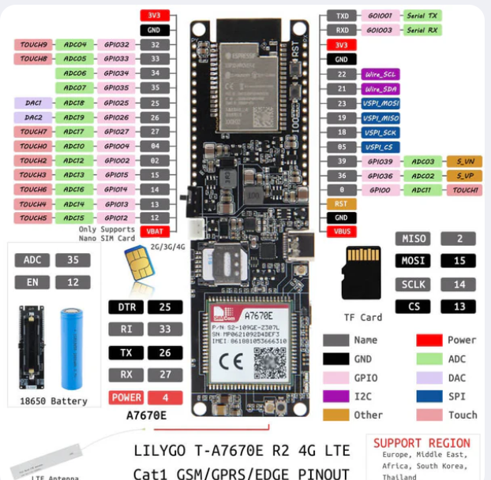

Seguindo a apostila que está no README.md no capítulo 5(GPIO no Esp32). Vamos fazer um pisca LED simples para começar a conhecer os pinos do hardware do lilygo(você pode usar qualquer esp32, estou usando o lilygo por que irei usar para fins de iot tracker mais pra frente).

## Antes de seguirmos, verifica se o intelissense de dentro do container está funcionando, digita por exemplo ``` #include "freertos/FreeRTOS.h ``` para ver se o vscode preenche o resto. Caso não, siga o path abaixo.

## 🛠️ Roadmap: Configuração do IntelliSense no VS Code via Docker

1. Requisitos no VS Code (Máquina Host)

    Extensão Dev Containers: Permite anexar o VS Code diretamente ao container em execução (Dev Containers: Attach to Running Container...).

    Extensão C/C++ da Microsoft: Deve estar instalada dentro do container (o VS Code pedirá para instalar no container assim que você conectar).

2. Estrutura do Projeto ESP-IDF (Dentro da pasta)

Verifique se a hierarquia de arquivos e nomes do projeto está alinhada:
Plaintext
``` bash
meu_projeto/
├── .vscode/
│   └── c_cpp_properties.json   <-- Configuração do IntelliSense
├── CMakeLists.txt              <-- CMake principal do projeto
├── main/
│   ├── CMakeLists.txt          <-- Registro do componente (SRCS aponta para o arquivo .c correto)
│   └── main.c (ou blink_led.c)
└── build/                      <-- Gerado após o idf.py build
    └── compile_commands.json   <-- Mapeamento de headers/includes
````

3. Configuração do .vscode/c_cpp_properties.json

Crie ou edite este arquivo na raiz do projeto para indicar ao VS Code onde buscar os comandos de compilação e as pastas dos drivers nativos do ESP-IDF (/opt/esp/idf/components):
JSON
``` bash
{
  "configurations": [
    {
      "name": "ESP-IDF Docker Direct",
      "includePath": [
        "${workspaceFolder}/**",
        "/opt/esp/idf/components/**"
      ],
      "compileCommands": "${workspaceFolder}/build/compile_commands.json",
      "cStandard": "c11",
      "cppStandard": "c++17"
    }
  ],
  "version": 4
}
```
4. Fluxo de Trabalho e Inicialização (Comandos)

Sempre que criar um projeto novo ou adicionar dependências:

    Gere os arquivos de compilação na raiz do projeto:
    Bash

    cd /project/seu_projeto
    idf.py reconfigure
    # ou
    idf.py build

    (Isso cria/atualiza o build/compile_commands.json e o sdkconfig.h).

    Force a atualização do cache do IntelliSense no VS Code:

        Abra a paleta de comandos (Ctrl + Shift + P).

        Rode: C/C++: Reset IntelliSense Database.

        Rode: Developer: Reload Window.
## Observação!
Sempre que for abrir o container para trabalhar em algum projeto, abra apartir deste comando: 
```docker run -it --rm -v $(pwd):/project -w /project espressif/idf:latest```

