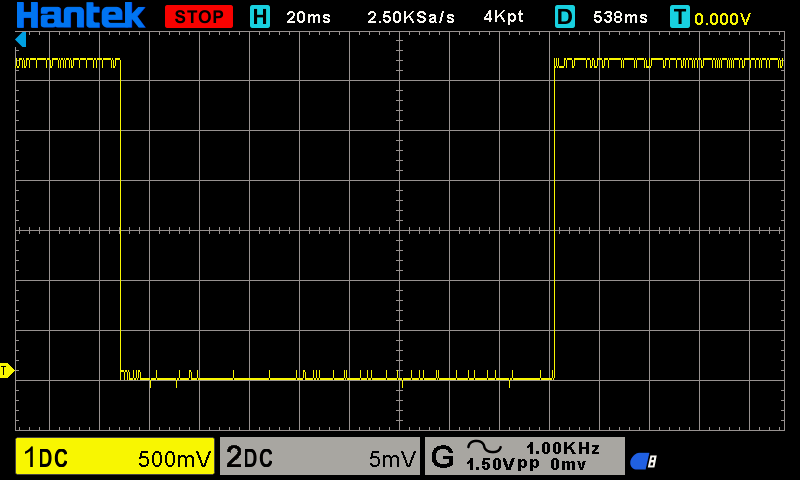

## ⚡ Por que o debounce importa de verdade em projetos profissionais

Não é só um exercício acadêmico — debounce mal feito (ou ausente) é uma das causas mais comuns de bugs "fantasmas" em produtos eletrônicos reais. Vou explicar o impacto prático e onde ele aparece.

---

### 🔍 O que acontece sem debounce em produção

Um contato mecânico (botão, chave, relé, interruptor) nunca faz uma transição limpa — ele "quica" fisicamente por alguns microssegundos a poucos milissegundos, gerando várias transições elétricas falsas para um único toque humano. Sem filtrar isso:

- Um clique único é interpretado como múltiplos cliques
- Uma interrupção por borda (`GPIO_INTR_NEGEDGE`) dispara dezenas de vezes para um único evento físico
- Contadores, máquinas de estado e menus "pulam" passos inesperadamente
- O comportamento é intermitente — funciona bem na maior parte do tempo, falha esporadicamente, dependendo do desgaste do contato, umidade, temperatura — o tipo de bug mais caro de debugar porque não é reproduzível de forma confiável em bancada 🧨

Esse último ponto é o que mais dói profissionalmente: bugs intermitentes em campo geram chamados de suporte, devoluções de produto, e são extremamente difíceis de reproduzir no laboratório.

---

### 🌐 Onde debounce (e sua contraparte em software, "filtro de estabilidade") aparece

**🖐️ Interfaces humanas físicas**

- Teclados, teclados de membrana, botões de painel industrial, botões de emergência (E-stop) — aqui um debounce mal calibrado pode significar não desligar uma máquina a tempo, ou pior, "perder" o comando de parada de emergência.
- Encoders rotativos (potenciômetros digitais) — sem debounce, contam pulsos fantasmas e o valor "pula" sozinho.

**🏭 Sensores digitais de campo**

- Sensores de fim de curso (*limit switches*) em esteiras industriais, portões automáticos, braços robóticos — aqui o debounce evita que o sistema de controle receba uma leitura falsa de "cheguei no fim do curso" no meio do movimento.
- Sensores de porta/janela em sistemas de segurança/alarme.
- Chaves de nível de líquido (bóia) em reservatórios — o líquido balança, a bóia oscila fisicamente, e sem filtro de tempo o sistema liga/desliga a bomba repetidamente (o que desgasta o motor e o contator).

**🚗 Automotivo**

- Sensores de porta aberta/fechada, cinto de segurança, freio de mão — todos passam por debounce em firmware antes de disparar qualquer lógica (alarme, trava, luz de painel).

**📡 Comunicação e protocolos**

- Sinais de "carrier detect" ou "link up/down" em interfaces seriais e de rede às vezes usam a mesma lógica de "estabilidade por tempo mínimo" antes de considerar a mudança de estado como real — o princípio matemático é idêntico, mesmo não sendo um "botão" fisicamente.

**🔋 Sistemas de potência**

- Detecção de queda de energia (para acionar backup de bateria, como no seu próprio projeto com a 18650) — geralmente não se reage à primeira leitura de "tensão caiu", mas só depois de confirmar que a queda persiste por um tempo mínimo, para não trocar de fonte por causa de um ruído transitório na rede elétrica.

---

### 🧮 O ganho de entender a matemática por trás (não só copiar uma lib)

Em projetos profissionais, cada aplicação tem uma janela de debounce diferente, calibrada para o hardware específico:

- Botões de membrana baratos → podem precisar de 50ms+ (contato mais "sujo")
- Chaves mecânicas de alta qualidade (industriais) → às vezes bastam 5-10ms
- Sensores de fim de curso magnéticos (*reed switch*) → geralmente têm bounce quase desprezível, mas ainda assim se usa alguns ms de margem

Quem só usa uma biblioteca pronta com um valor fixo de debounce corre o risco de aplicar um filtro genérico demais — não filtra o suficiente em hardware ruidoso, ou introduz atraso perceptível/inaceitável em uma aplicação que precisa de resposta rápida, como um E-stop. ⚠️

Entender a lógica — que foi exatamente o que você acabou de implementar do zero 🛠️ — é o que permite calibrar corretamente para cada componente físico real, em vez de copiar um "número mágico" da internet.

Próximo passo (interrupções - capítulo 3 ) dá pra comparar as duas abordagens na prática: debounce por **polling**(Que é o foi feito) vs debounce combinado com **interrupção de borda + temporizador**, que é o padrão mais usado em firmware profissional por que consome menos CPU (a task só acorda quando algo muda, em vez de checar 100x por segundos o tempo todo).

## Conclusão.

Arranjo de circuito T-A7670 + imagem da borda de descida ampliada.

Foto tirada no osciloscópio