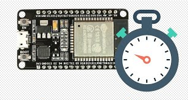
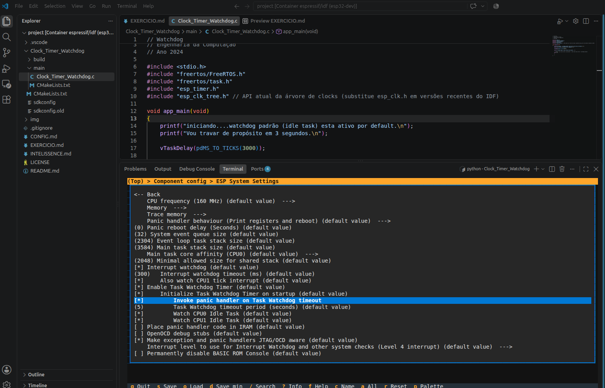

## Clocks, Timers e Watchdog

### Exercício 2.3:
- Habilite o Task Watchdog Timer (TWDT) na task principal e force, de propósito, um travamento (`while(1);` sem yield) para observar o reset e o log de pânico. Depois, corrija o código para alimentar o watchdog corretamente.

---

# Documentação: configurando o menuconfig e analisando o funcionamento do watchdog

## Introdução
Em computação e sistemas embarcados, o watchdog é um temporizador que reinicia automaticamente um sistema quando o software ou o hardware trava.

Esse mecanismo previne o travamento de dispositivos, evitando que fiquem congelados indefinidamente sem resposta humana. É vital também em equipamentos remotos ou de difícil acesso (como satélites, sondas espaciais ou dispositivos IoT), onde o reset manual é impossível. Por fim, este sistema de reset restaura a normalização do sistema em milissegundos após detectar falhas de processamento.

O programa abaixo mostra um exemplo simples do funcionamento do watchdog configurado no `menuconfig`. Devido à falta de comandos que cedam tempo de CPU dentro do loop infinito, o ESP32 trava. Porém, com o watchdog habilitado, o sistema reinicia automaticamente toda vez que a falha ocorre. Analise o código abaixo:

```c
#include <stdio.h>
#include "freertos/FreeRTOS.h"
#include "freertos/task.h"
#include "esp_timer.h"
#include "esp_clk_tree.h" // API atual da árvore de clocks (substitui esp_clk.h em versões recentes do IDF)

void app_main(void)
{
    printf("Iniciando.... O watchdog padrão (idle task) está ativo por padrão.\n");
    printf("Vou travar de propósito em 3 segundos.\n");

    vTaskDelay(pdMS_TO_TICKS(3000));

    printf("Travando agora (loop infinito sem yield)...\n");

    // ATENÇÃO: isso nunca cede o processador -> idle task nunca roda -> watchdog dispara
    while (1)
    {
        // Travamento intencional
    }
}
```

## Conclusão
Para habilitar o watchdog no ESP32, deve-se entrar no menu de configuração digitando `idf.py menuconfig`, navegar até **Component config -> ESP System Settings** e marcar a opção correspondente que consta na imagem abaixo.


