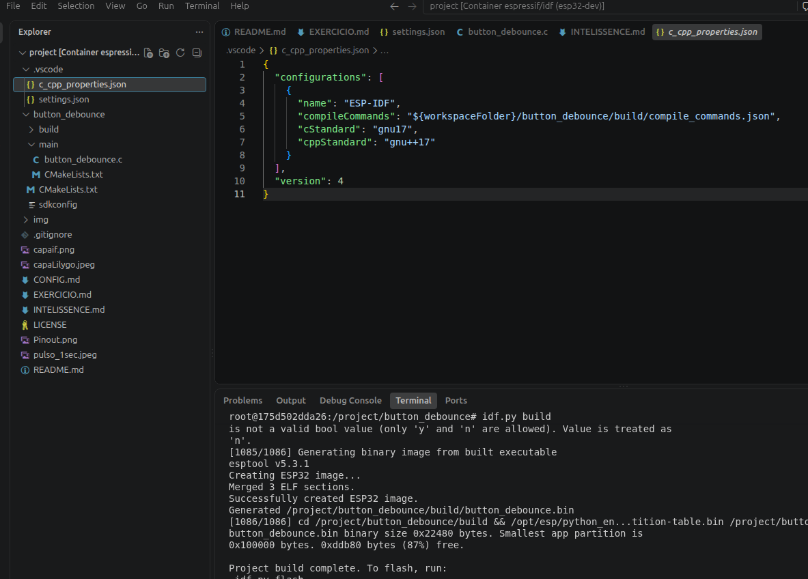

Na falta de intelissense, criar o arquivo c_cpp_properties.json dentro do diretório project/.vscode
e colar 
```bash
{
  "configurations": [
    {
      "name": "ESP-IDF",
      "compileCommands": "${workspaceFolder}/button_debounce/build/compile_commands.json",
      "cStandard": "gnu17",
      "cppStandard": "gnu++17"
    }
  ],
  "version": 4
}
``` 

