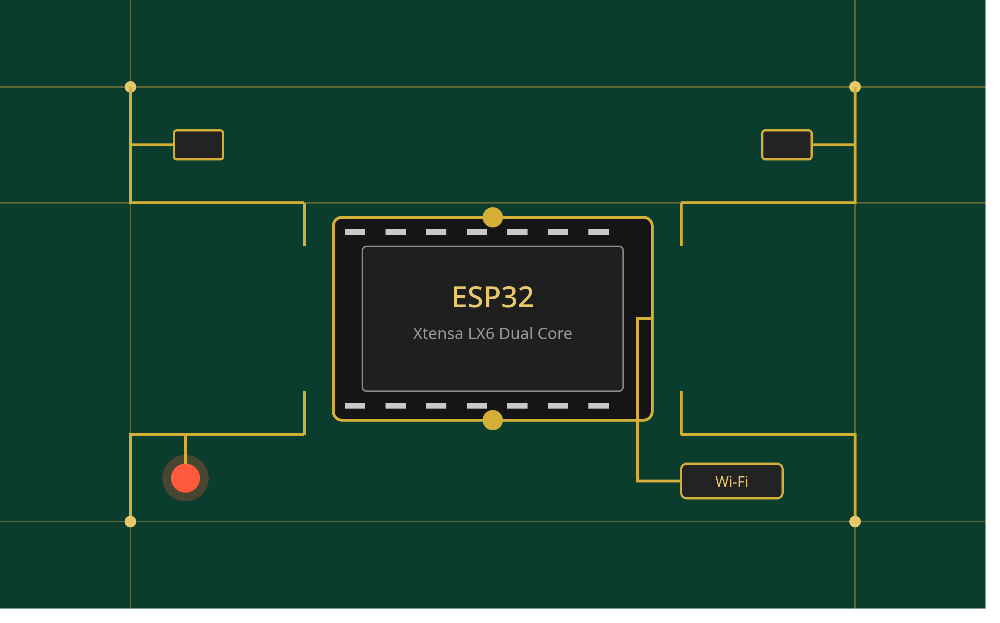

## 📘 Apostila Completa de Sistemas Embarcados — ESP32 (ESP-IDF)

Esta apostila foi construída para levar você do zero absoluto em sistemas embarcados até um nível **pleno** de desenvolvimento com o ESP32 usando o framework oficial **ESP-IDF**. Ela começa com uma visão panorâmica de microcontroladores em geral (PIC, AVR, ARM Cortex-M, STM32, ESP32/Xtensa) — porque entender **por que** o ESP32 é como é fica muito mais fácil quando você sabe com o que ele está sendo comparado — e depois aprofunda em cada subsistema do chip, do GPIO mais simples até FreeRTOS, DMA, Wi-Fi/BLE e, por fim, noções de projeto de PCB para colocar o ESP32 em produção.

## Sumário

- [Introdução Geral a Sistemas Embarcados](#introdução-geral-a-sistemas-embarcados)
- [1. Panorama de Microcontroladores](#1-panorama-de-microcontroladores)
- [2. Arquitetura de um Microcontrolador](#2-arquitetura-de-um-microcontrolador)
- [3. Fundamentos Universais — Válidos para Qualquer MCU](#3-fundamentos-universais--válidos-para-qualquer-mcu)
- [4. Ambiente ESP-IDF — Instalação e Primeiro Projeto](#4-ambiente-esp-idf--instalação-e-primeiro-projeto)
- [5. GPIO no ESP32](#5-gpio-no-esp32)
- [6. Clocks no ESP32](#6-clocks-no-esp32)
- [7. Timers no ESP32](#7-timers-no-esp32)
- [8. Watchdog Timers no ESP32](#8-watchdog-timers-no-esp32)
- [9. Interrupções no ESP32](#9-interrupções-no-esp32)
- [10. Mapa de Memória do ESP32](#10-mapa-de-memória-do-esp32)
- [11. ADC e DAC no ESP32](#11-adc-e-dac-no-esp32)
- [12. PWM com o Periférico LEDC](#12-pwm-com-o-periférico-ledc)
- [13. Comunicação Serial: UART, I2C e SPI](#13-comunicação-serial-uart-i2c-e-spi)
- [14. FreeRTOS no ESP32](#14-freertos-no-esp32)
- [15. Gerenciamento de Energia e Deep Sleep](#15-gerenciamento-de-energia-e-deep-sleep)
- [16. NVS e Sistema de Partições](#16-nvs-e-sistema-de-partições)
- [17. Wi-Fi e Bluetooth (BLE)](#17-wi-fi-e-bluetooth-ble)
- [18. Multicore: Dual-Core e Pinning de Tasks](#18-multicore-dual-core-e-pinning-de-tasks)
- [19. DMA (Direct Memory Access)](#19-dma-direct-memory-access)
- [20. Debug: JTAG, Core Dump e Logging](#20-debug-jtag-core-dump-e-logging)
- [21. OTA — Atualização de Firmware Remota](#21-ota--atualização-de-firmware-remota)
- [22. Projeto de PCB para ESP32](#22-projeto-de-pcb-para-esp32)
- [23. Trilha de Estudo para se Tornar Pleno](#23-trilha-de-estudo-para-se-tornar-pleno)
- [Recursos Adicionais](#recursos-adicionais)

---

## Introdução Geral a Sistemas Embarcados

Um **sistema embarcado** é um sistema computacional dedicado a executar uma função específica dentro de um produto maior — diferente de um computador de propósito geral, ele não roda "qualquer programa": ele roda **o firmware** para o qual foi projetado, geralmente com restrições de memória, energia e custo muito mais apertadas que um PC.

No coração da maioria dos sistemas embarcados está um **microcontrolador (MCU)** — um chip que integra em uma única pastilha de silício:

- Uma **CPU** (núcleo de processamento);
- **Memória** (RAM para dados voláteis, Flash/ROM para o programa);
- **Periféricos** (GPIO, timers, ADC, UART, SPI, I2C, PWM, etc.);
- Um ou mais **osciladores/clocks** que ditam o ritmo de tudo.

Isso é bem diferente de um microprocessador "puro" (como um Intel x86 ou um ARM de aplicação, ex: os que rodam Linux em um Raspberry Pi), que depende de chips externos (RAM, storage, periféricos) para funcionar. O microcontrolador é, por definição, **um computador completo em um único chip**, embora modesto em recursos.

### Por que estudar vários microcontroladores antes de focar no ESP32?

Cada família de MCU tem particularidades de fabricante, mas os **conceitos fundamentais são os mesmos** em praticamente todos: GPIO, timer, interrupção, watchdog, clock, endereço de memória. Quando você entende esses conceitos de forma desacoplada de um fabricante específico, fica muito mais fácil migrar entre plataformas — e mais fácil também entender *por que* o ESP-IDF expõe as APIs do jeito que expõe.

[Voltar ao Sumário](#sumário)

---

## 1. Panorama de Microcontroladores

### 1.1 PIC (Microchip)

A família **PIC** (Peripheral Interface Controller), da Microchip, é uma das mais tradicionais no ensino de eletrônica embarcada, especialmente no Brasil. Características centrais:

- Arquitetura **Harvard** (memória de programa e de dados fisicamente separadas);
- Conjunto de instruções **RISC** reduzido (em modelos como o PIC16, apenas ~35 instruções);
- Faixas populares: **PIC10/12** (muito simples, poucos pinos), **PIC16/18** (uso geral, 8 bits), **PIC24/dsPIC** (16 bits, com DSP), **PIC32** (32 bits, núcleo MIPS);
- Programação tradicionalmente feita em **Assembly** ou **C** com o compilador **XC8/XC16/XC32** da própria Microchip, usando o ambiente **MPLAB X**;
- Muito usado em cursos técnicos e produtos de baixo custo (eletrodomésticos, controle de motores simples).

### 1.2 AVR (Atmel, hoje parte da Microchip)

A família **AVR** ficou mundialmente popular por ser o coração da plataforma **Arduino** (o ATmega328P está no Arduino Uno).

- Também arquitetura **Harvard**, RISC de 8 bits;
- Executa a maioria das instruções em **1 ciclo de clock**, o que a torna relativamente rápida para um MCU de 8 bits;
- Programável em C/C++ com **avr-gcc**, ou através do **Arduino IDE** (que abstrai boa parte do registro de baixo nível);
- Pontos fortes: simplicidade, comunidade gigantesca, farto material didático;
- Limitações: pouca RAM (ex: 2KB no ATmega328P), sem suporte nativo a Wi-Fi/BLE, sem múltiplos núcleos.

### 1.3 ARM Cortex-M (STM32, NXP, Nordic, entre outros)

O núcleo **ARM Cortex-M** não é fabricado por uma única empresa — é uma **arquitetura licenciada** pela ARM Holdings, implementada por vários fabricantes (STMicroelectronics com a linha **STM32**, NXP, Nordic Semiconductor com a série **nRF**, entre outros).

- Arquitetura **Harvard modificada**, 32 bits, RISC (conjunto de instruções **Thumb-2**);
- Variantes: **Cortex-M0/M0+** (ultra baixo custo/consumo), **Cortex-M3/M4** (uso geral, M4 com FPU e DSP), **Cortex-M7** (alto desempenho);
- Ecossistema de desenvolvimento maduro: **STM32CubeIDE**, **HAL/LL drivers**, e suporte de primeira classe em RTOS como FreeRTOS e Zephyr;
- Muito usado em produtos industriais, wearables (Nordic nRF com BLE nativo) e automotivo.

### 1.4 Xtensa (Tensilica) — o núcleo por trás do ESP32

O **ESP32**, da Espressif, não usa ARM nem AVR: ele usa o núcleo **Xtensa LX6/LX7**, licenciado da Tensilica (hoje parte da Cadence).

- Arquitetura **Harvard**, 32 bits;
- O ESP32 "clássico" tem **dois núcleos Xtensa LX6** rodando a até 240 MHz (dual-core), enquanto variantes como o ESP32-C3 usam núcleo **RISC-V** em vez de Xtensa;
- Diferencial: **Wi-Fi 802.11 b/g/n e Bluetooth (Classic + BLE) integrados no próprio chip**, algo raro em MCUs tradicionais — normalmente isso exigiria um chip de rádio externo;
- Framework oficial: **ESP-IDF** (Espressif IoT Development Framework), baseado em **FreeRTOS**, escrito em C/C++, com build system baseado em **CMake**;
- Também é possível programar via **Arduino core para ESP32**, que roda por cima do ESP-IDF de forma simplificada — mas para dominar o chip de verdade, o caminho é o ESP-IDF puro, que é o foco desta apostila.

### 1.5 Tabela Comparativa

| Característica | PIC | AVR | STM32 (Cortex-M) | ESP32 (Xtensa) |
|---|---|---|---|---|
| Arquitetura | Harvard, 8/16/32 bits | Harvard, 8 bits | Harvard modificada, 32 bits | Harvard, 32 bits |
| Núcleos | 1 | 1 | 1 (geralmente) | 2 (dual-core, em variantes clássicas) |
| Clock típico | 4–64 MHz | 8–20 MHz | 48–480 MHz | até 240 MHz |
| Wi-Fi/BLE integrado | ❌ | ❌ | ❌ (geralmente) | ✅ |
| RTOS comum | Opcional (bare-metal comum) | Opcional | FreeRTOS/Zephyr | FreeRTOS (obrigatório na prática) |
| IDE oficial | MPLAB X | Arduino IDE / Atmel Studio | STM32CubeIDE | ESP-IDF (VS Code / CLI) |
| Foco típico | Produtos simples, ensino | Prototipagem, Arduino | Industrial, alto desempenho | IoT conectado (Wi-Fi/BLE) |

> 💡 **Onde o ESP32 se encaixa?** Ele não é o mais barato, nem o de menor consumo — mas é, disparado, um dos mais **completos para IoT**, já que integra rádio Wi-Fi/BLE, dual-core, criptografia em hardware e um ecossistema de software maduro (ESP-IDF) em um único chip de baixo custo.

[Voltar ao Sumário](#sumário)

---

## 2. Arquitetura de um Microcontrolador

### 2.1 Harvard vs. Von Neumann

- **Von Neumann:** uma única memória e um único barramento compartilhados entre instruções e dados. Simples, mas cria um "gargalo" (a CPU não pode buscar uma instrução e um dado ao mesmo tempo).
- **Harvard:** memórias e barramentos **separados** para instruções (Flash) e dados (RAM). A CPU pode buscar a próxima instrução e acessar dados simultaneamente — mais rápido, e é o modelo usado por PIC, AVR, ARM Cortex-M e pelo Xtensa do ESP32.

### 2.2 RISC vs. CISC

- **CISC** (Complex Instruction Set Computer): instruções complexas, que fazem múltiplas operações em uma só linha de Assembly (ex: x86). Mais poder por instrução, mas decodificação mais cara.
- **RISC** (Reduced Instruction Set Computer): instruções simples e uniformes, cada uma executando rapidamente (idealmente em 1 ciclo). PIC, AVR, ARM e Xtensa são todos RISC — é o padrão dominante em microcontroladores modernos, por ser mais eficiente em energia e mais fácil de otimizar via pipeline.

### 2.3 Barramentos e Periféricos

Um MCU se comunica internamente através de **barramentos** (conjuntos de fios que carregam endereço, dado e controle). No ESP32, por exemplo, existem barramentos internos dedicados conectando a CPU à Flash (via cache), à RAM interna e aos periféricos (mapeados em endereços específicos — veja a seção [10. Mapa de Memória](#10-mapa-de-memória-do-esp32)).

Cada periférico (GPIO, timer, UART, etc.) é, do ponto de vista da CPU, um conjunto de **registradores mapeados em memória** — a CPU "conversa" com o hardware simplesmente lendo e escrevendo em endereços específicos. O ESP-IDF abstrai isso em funções de alto nível (`gpio_set_level()`, por exemplo), mas por baixo dos panos é exatamente isso que está acontecendo.

[Voltar ao Sumário](#sumário)

---

## 3. Fundamentos Universais — Válidos para Qualquer MCU

Antes de mergulhar no ESP-IDF, vale entender os seis pilares que se repetem em **qualquer** microcontrolador do mercado. Depois desta seção, cada um deles será revisitado especificamente no contexto do ESP32.

### 3.1 GPIO (General Purpose Input/Output)

Pinos físicos do chip que podem ser configurados via software como **entrada** (ler um nível de tensão — alto/baixo) ou **saída** (impor um nível de tensão). É a forma mais básica de um MCU interagir com o mundo externo: acender um LED, ler um botão, detectar uma borda de sinal.

### 3.2 Clocks e Osciladores

Todo MCU precisa de um "batimento cardíaco" — um sinal de clock que sincroniza cada ciclo de execução da CPU e de seus periféricos. Esse clock normalmente vem de:

- Um **oscilador interno** (RC), menos preciso, mas não exige componentes externos;
- Um **cristal externo** (quartzo), muito mais preciso — essencial quando se precisa de comunicação serial confiável ou temporização exata (ex: Wi-Fi exige um clock de referência preciso).

MCUs modernos costumam ter **PLLs** (Phase-Locked Loop) que multiplicam um clock de referência mais baixo para gerar as frequências mais altas usadas pela CPU.

### 3.3 Timers e Contadores

Um **timer** é, essencialmente, um registrador que incrementa (ou decrementa) automaticamente a cada pulso de clock, sem intervenção da CPU. É usado para:

- Medir intervalos de tempo com precisão (sem usar `delay` bloqueante);
- Gerar interrupções periódicas;
- Gerar sinais PWM (contando até um valor e reiniciando).

### 3.4 Watchdog Timer (WDT)

Um **watchdog** é um timer especial que, se não for "alimentado" (resetado) periodicamente pelo software dentro de um prazo configurado, **reinicia o microcontrolador**. É um mecanismo de segurança contra travamentos: se o firmware entrar em loop infinito ou travar por um bug, o watchdog garante que o sistema se recupere sozinho.

### 3.5 Endereços de Memória

Cada MCU tem um **mapa de memória**: uma faixa de endereços dedicada à Flash (código), outra à RAM (dados), e outra aos registradores dos periféricos. Entender esse mapa é fundamental para debugging de baixo nível (analisar um *core dump*, por exemplo) e para otimizar o uso de memória em projetos com recursos escassos.

### 3.6 Interrupções

Uma **interrupção** é um mecanismo que permite que um evento de hardware (um pino mudando de estado, um timer estourando, um dado chegando pela UART) **pause** a execução normal do programa, execute uma função específica (a *Interrupt Service Routine*, ou **ISR**), e depois retome exatamente de onde parou. É o que torna possível reagir rapidamente a eventos sem ficar constantemente checando ("polling") o estado de cada periférico em loop.

[Voltar ao Sumário](#sumário)

---

## 4. Ambiente ESP-IDF — Instalação e Primeiro Projeto

O **ESP-IDF** (Espressif IoT Development Framework) é o SDK oficial para o ESP32, escrito em C, com build system baseado em **CMake** e sistema de compilação/flash orquestrado pela ferramenta `idf.py`. Ele já vem com **FreeRTOS** embutido — no ESP-IDF, todo código roda dentro de pelo menos uma *task* do FreeRTOS, mesmo que você não perceba isso de início.

### 4.1 Instalação (Linux/macOS)

```bash
# Clona o repositório oficial do ESP-IDF
git clone --recursive https://github.com/espressif/esp-idf.git
cd esp-idf

# Instala as ferramentas (toolchain, compilador, etc.) para o ESP32
./install.sh esp32

# Ativa o ambiente no terminal atual (precisa ser rodado a cada nova sessão de terminal)
. ./export.sh
```

**Saída (resumida):**

```bash
Installing ESP-IDF tools
Installing Xtensa toolchain for esp32
...
All done! You can now run:
  . ./export.sh
```

### 4.2 Criando o Primeiro Projeto

```bash
idf.py create-project meu_primeiro_projeto
cd meu_primeiro_projeto
```

**Estrutura gerada:**

```bash
meu_primeiro_projeto/
├── CMakeLists.txt
├── main/
│   ├── CMakeLists.txt
│   └── meu_primeiro_projeto.c
└── sdkconfig        # gerado após o primeiro build/menuconfig
```

### 4.3 "Hello World" — Compilar, Configurar Porta, Gravar e Monitorar

```bash
# Define o chip alvo (necessário na primeira vez ou ao trocar de chip)
idf.py set-target esp32

# Compila o projeto
idf.py build

# Grava o firmware na placa e abre o monitor serial (Ctrl+] para sair)
idf.py -p /dev/ttyUSB0 flash monitor
```

**Saída (monitor serial):**

```bash
I (315) cpu_start: Starting scheduler on PRO CPU.
I (0) cpu_start: Starting scheduler on APP CPU.
I (325) main_task: Started on CPU0
I (325) main_task: Calling app_main()
Hello world!
```

💡 **`idf.py menuconfig`** abre um menu interativo (baseado em `Kconfig`) onde você configura opções do projeto — desde a frequência de clock da CPU até quais componentes (Wi-Fi, Bluetooth, etc.) serão compilados. É equivalente ao `.config` usado na compilação do kernel Linux, e vale a pena explorar desde cedo.

[Voltar ao Sumário](#sumário)

---

## 5. GPIO no ESP32

O ESP32 possui até **34 pinos GPIO** fisicamente disponíveis (a contagem exata varia por variante/encapsulamento), numerados de `GPIO0` a `GPIO39`, sendo que alguns são **apenas entrada** (GPIO34–39, sem resistor de pull-up/down interno) e outros têm funções especiais reservadas no boot (GPIO0, GPIO2, GPIO12, GPIO15) que exigem cuidado ao projetar o hardware.

### 5.1 Saída Digital — Piscando um LED

```bash
#include <stdio.h>
#include "freertos/FreeRTOS.h"
#include "freertos/task.h"
#include "driver/gpio.h"

#define LED_PIN GPIO_NUM_2

void app_main(void)
{
    // Configura o pino como saída
    gpio_reset_pin(LED_PIN);
    gpio_set_direction(LED_PIN, GPIO_MODE_OUTPUT);

    while (1) {
        gpio_set_level(LED_PIN, 1); // nível alto (LED aceso)
        vTaskDelay(pdMS_TO_TICKS(500));

        gpio_set_level(LED_PIN, 0); // nível baixo (LED apagado)
        vTaskDelay(pdMS_TO_TICKS(500));
    }
}
```

**Saída (monitor serial, mostrando o log padrão de boot; o LED físico pisca a cada 500ms):**

```bash
I (325) main_task: Calling app_main()
I (330) gpio: GPIO[2]| InputEn: 0| OutputEn: 1| OpenDrain: 0| Pullup: 0| Pulldown: 0| Intr:0
```

### 5.2 Entrada Digital — Lendo um Botão

```bash
#include <stdio.h>
#include "freertos/FreeRTOS.h"
#include "freertos/task.h"
#include "driver/gpio.h"

#define BUTTON_PIN GPIO_NUM_4

void app_main(void)
{
    gpio_reset_pin(BUTTON_PIN);
    gpio_set_direction(BUTTON_PIN, GPIO_MODE_INPUT);
    gpio_set_pull_mode(BUTTON_PIN, GPIO_PULLUP_ONLY); // resistor de pull-up interno

    while (1) {
        int nivel = gpio_get_level(BUTTON_PIN);
        printf("Estado do botão: %d\n", nivel); // 0 = pressionado (se ligado ao GND)
        vTaskDelay(pdMS_TO_TICKS(200));
    }
}
```

**Saída:**

```bash
Estado do botão: 1
Estado do botão: 1
Estado do botão: 0
Estado do botão: 0
Estado do botão: 1
```

⚠️ **Cuidado com pinos "strapping":** `GPIO0`, `GPIO2`, `GPIO5`, `GPIO12` e `GPIO15` influenciam o modo de boot do ESP32 (por exemplo, `GPIO0` em nível baixo durante o reset coloca o chip em modo de gravação via UART). Evite usá-los para funções críticas sem entender as implicações, principalmente no hardware final.

[Voltar ao Sumário](#sumário)

---

## 6. Clocks no ESP32

O ESP32 tem uma árvore de clock relativamente sofisticada, com múltiplas fontes possíveis:

- **Cristal externo de 40 MHz** (o mais comum nas placas de desenvolvimento): fonte de referência precisa, usada inclusive pelo rádio Wi-Fi/BLE;
- **Oscilador RC interno**: menos preciso, usado principalmente em modos de baixo consumo (RTC);
- **PLL interno**: multiplica o clock de referência para gerar a frequência da CPU (até 240 MHz nas variantes que suportam essa velocidade).

### 6.1 Consultando e Ajustando a Frequência da CPU

A frequência da CPU pode ser configurada via `idf.py menuconfig` (em `Component config → ESP32-specific → CPU frequency`) ou, em tempo de execução, via a API de gerenciamento de energia (`esp_pm`).

```bash
#include <stdio.h>
#include "esp_system.h"
#include "esp_chip_info.h"

void app_main(void)
{
    esp_chip_info_t chip_info;
    esp_chip_info(&chip_info);

    printf("Modelo do chip: %s\n", (chip_info.model == CHIP_ESP32) ? "ESP32" : "Outro");
    printf("Núcleos: %d\n", chip_info.cores);
    printf("Revisão do silício: %d\n", chip_info.revision);
    printf("Frequência da CPU (config): %d MHz\n", CONFIG_ESP_DEFAULT_CPU_FREQ_MHZ);
}
```

**Saída:**

```bash
Modelo do chip: ESP32
Núcleos: 2
Revisão do silício: 3
Frequência da CPU (config): 240 MHz
```

💡 Reduzir a frequência de clock (por exemplo, para 80 MHz) é uma das formas mais simples de economizar energia em projetos alimentados por bateria, ao custo de menor throughput de processamento.

[Voltar ao Sumário](#sumário)

---

## 7. Timers no ESP32

O ESP-IDF oferece duas APIs principais para temporização: `esp_timer` (baseado em um timer de hardware de 64 bits, ótimo para *callbacks* de software com resolução de microssegundos) e o driver de **timer de propósito geral (GPTimer)**, mais próximo do hardware, para quando você precisa de controle fino (contagem, captura, alarmes).

### 7.1 `esp_timer` — Callback Periódico

```bash
#include <stdio.h>
#include "esp_timer.h"
#include "freertos/FreeRTOS.h"
#include "freertos/task.h"

static void temporizador_callback(void *arg)
{
    printf("Tick do timer! Tempo desde o boot: %lld us\n", esp_timer_get_time());
}

void app_main(void)
{
    const esp_timer_create_args_t args = {
        .callback = &temporizador_callback,
        .name = "meu_timer"
    };

    esp_timer_handle_t timer;
    esp_timer_create(&args, &timer);

    // Dispara a cada 1 segundo (1.000.000 microssegundos), de forma periódica
    esp_timer_start_periodic(timer, 1000000);

    vTaskDelay(pdMS_TO_TICKS(3500)); // deixa rodar por 3.5s antes de encerrar
}
```

**Saída:**

```bash
Tick do timer! Tempo desde o boot: 1002134 us
Tick do timer! Tempo desde o boot: 2002210 us
Tick do timer! Tempo desde o boot: 3002298 us
```

### 7.2 GPTimer — Alarme de Hardware com Interrupção

```bash
#include <stdio.h>
#include "driver/gptimer.h"
#include "freertos/FreeRTOS.h"
#include "freertos/task.h"

static bool IRAM_ATTR alarme_callback(gptimer_handle_t timer,
                                       const gptimer_alarm_event_data_t *edata,
                                       void *user_ctx)
{
    static int contador = 0;
    contador++;
    // ISR: mantenha o código aqui o mais curto possível
    return false; // não solicita um "yield" de task de alta prioridade
}

void app_main(void)
{
    gptimer_handle_t gptimer = NULL;
    gptimer_config_t config = {
        .clk_src = GPTIMER_CLK_SRC_DEFAULT,
        .direction = GPTIMER_COUNT_UP,
        .resolution_hz = 1000000, // 1 MHz -> cada tick = 1 microssegundo
    };
    gptimer_new_timer(&config, &gptimer);

    gptimer_event_callbacks_t cbs = { .on_alarm = alarme_callback };
    gptimer_register_event_callbacks(gptimer, &cbs, NULL);

    gptimer_alarm_config_t alarm_config = {
        .alarm_count = 500000, // dispara a cada 500ms
        .reload_count = 0,
        .flags.auto_reload_on_alarm = true,
    };
    gptimer_set_alarm_action(gptimer, &alarm_config);

    gptimer_enable(gptimer);
    gptimer_start(gptimer);

    vTaskDelay(pdMS_TO_TICKS(2000));
    printf("Timer de hardware rodando com alarmes a cada 500ms\n");
}
```

**Saída:**

```bash
Timer de hardware rodando com alarmes a cada 500ms
```

> ⚠️ Repare no atributo `IRAM_ATTR` na função de callback: ele garante que o código da ISR fique na **RAM interna** (IRAM), e não na Flash — essencial porque, durante certas operações de acesso à Flash (como escrita), o cache que normalmente serve o código é desabilitado, e uma ISR que dependesse da Flash simplesmente travaria o chip nesse momento.

[Voltar ao Sumário](#sumário)

---

## 8. Watchdog Timers no ESP32

O ESP32 tem **múltiplos watchdogs** trabalhando em conjunto:

- **Task Watchdog Timer (TWDT):** monitora se tasks específicas do FreeRTOS (por padrão, a *idle task* de cada núcleo) estão "respirando" periodicamente. Se uma task travar e não ceder a CPU, o TWDT dispara um pânico com o *stack trace* de qual task travou — extremamente útil para debugging.
- **Interrupt Watchdog:** garante que interrupções não fiquem desabilitadas por tempo demais (o que poderia travar o sistema silenciosamente).
- **RTC Watchdog:** opera mesmo durante deep sleep, protegendo contra travamentos no processo de boot.

### 8.1 Usando o Task Watchdog Timer

```bash
#include <stdio.h>
#include "esp_task_wdt.h"
#include "freertos/FreeRTOS.h"
#include "freertos/task.h"

void app_main(void)
{
    // Configura o TWDT: timeout de 3s, sem panic automático (apenas aviso)
    esp_task_wdt_config_t twdt_config = {
        .timeout_ms = 3000,
        .idle_core_mask = (1 << 0) | (1 << 1), // monitora ambos os núcleos
        .trigger_panic = true,
    };
    esp_task_wdt_reconfigure(&twdt_config);

    esp_task_wdt_add(NULL); // inscreve a task atual no watchdog

    for (int i = 0; i < 5; i++) {
        printf("Alimentando o watchdog... iteração %d\n", i);
        esp_task_wdt_reset(); // "alimenta" o watchdog, evitando o reset
        vTaskDelay(pdMS_TO_TICKS(1000));
    }

    esp_task_wdt_delete(NULL); // remove a task do monitoramento antes de encerrar
}
```

**Saída:**

```bash
Alimentando o watchdog... iteração 0
Alimentando o watchdog... iteração 1
Alimentando o watchdog... iteração 2
Alimentando o watchdog... iteração 3
Alimentando o watchdog... iteração 4
```

**Se, propositalmente, você não alimentar o watchdog** (por exemplo, removendo a chamada `esp_task_wdt_reset()` e colocando um `while(1);` infinito no lugar), a saída seria algo como:

```bash
E (3105) task_wdt: Task watchdog got triggered. The following tasks/users did not reset the watchdog in time:
E (3105) task_wdt:  - main (CPU 0)
E (3105) task_wdt: Tasks currently running:
E (3105) task_wdt: CPU 0: main
abort() was called at PC ... on core 0
Backtrace: 0x400... 0x400... 0x400...
Rebooting...
```

[Voltar ao Sumário](#sumário)

---

## 9. Interrupções no ESP32

### 9.1 Interrupção de GPIO (borda de subida/descida)

```bash
#include <stdio.h>
#include "driver/gpio.h"
#include "freertos/FreeRTOS.h"
#include "freertos/task.h"
#include "freertos/queue.h"

#define BOTAO GPIO_NUM_4

static QueueHandle_t fila_eventos;

// ISR: deve ser curta e rápida — apenas envia o evento para uma fila
static void IRAM_ATTR isr_botao(void *arg)
{
    uint32_t pino = (uint32_t)arg;
    xQueueSendFromISR(fila_eventos, &pino, NULL);
}

static void task_processadora(void *arg)
{
    uint32_t pino;
    while (1) {
        if (xQueueReceive(fila_eventos, &pino, portMAX_DELAY)) {
            printf("Interrupção detectada no GPIO %d\n", (int)pino);
        }
    }
}

void app_main(void)
{
    gpio_config_t config = {
        .pin_bit_mask = (1ULL << BOTAO),
        .mode = GPIO_MODE_INPUT,
        .pull_up_en = GPIO_PULLUP_ENABLE,
        .intr_type = GPIO_INTR_NEGEDGE, // dispara na borda de descida
    };
    gpio_config(&config);

    fila_eventos = xQueueCreate(10, sizeof(uint32_t));

    gpio_install_isr_service(0);
    gpio_isr_handler_add(BOTAO, isr_botao, (void *)BOTAO);

    xTaskCreate(task_processadora, "processadora", 2048, NULL, 10, NULL);
}
```

**Saída (ao pressionar o botão três vezes):**

```bash
Interrupção detectada no GPIO 4
Interrupção detectada no GPIO 4
Interrupção detectada no GPIO 4
```

💡 **Por que usar uma fila em vez de processar tudo dentro da ISR?** ISRs no ESP-IDF rodam com prioridade máxima e devem ser **extremamente curtas** — qualquer operação demorada (como `printf`, alocação de memória, ou acesso à Flash) dentro de uma ISR pode causar travamentos ou corromper o sistema. O padrão idiomático é: a ISR apenas sinaliza o evento (via fila, semáforo ou *task notification*), e uma task de prioridade normal faz o processamento pesado.

[Voltar ao Sumário](#sumário)

---

## 10. Mapa de Memória do ESP32

O ESP32 possui um mapa de memória relativamente complexo, combinando memória interna rápida com Flash externa acessada via cache. Em linhas gerais:

| Região | Faixa de Endereço (típica) | Descrição |
|---|---|---|
| IRAM (Instruction RAM) | `0x4008_0000 – 0x400A_0000` | RAM interna rápida, usada para código crítico (ISRs, `IRAM_ATTR`) |
| DRAM (Data RAM) | `0x3FFA_E000 – 0x4000_0000` | RAM interna para dados (heap, stacks das tasks) |
| Flash Externa (via cache) | `0x400D_0000` em diante (mapeada) | Código do programa e dados constantes, acessados via cache de instrução |
| RTC Memory | `0x3FF8_0000` região | Pequena região de memória que sobrevive ao deep sleep |
| Registradores de Periféricos | endereços fixos por periférico | GPIO, timers, UART, etc., mapeados em memória |

### 10.1 Inspecionando o Uso de Memória em Tempo Real

```bash
#include <stdio.h>
#include "esp_system.h"
#include "esp_heap_caps.h"

void app_main(void)
{
    printf("Heap livre (total): %ld bytes\n", esp_get_free_heap_size());
    printf("Heap livre (menor valor já observado): %ld bytes\n", esp_get_minimum_free_heap_size());
    printf("Maior bloco contíguo disponível: %d bytes\n",
           heap_caps_get_largest_free_block(MALLOC_CAP_8BIT));
}
```

**Saída:**

```bash
Heap livre (total): 296420 bytes
Heap livre (menor valor já observado): 296420 bytes
Maior bloco contíguo disponível: 110584 bytes
```

### 10.2 Analisando o Binário com `idf.py size`

```bash
idf.py size
```

**Saída:**

```bash
Total sizes:
Used static IRAM:   38224 bytes ( 92112 remain, 29.3% used)
      .text: 36012 bytes
      .vectors: 1024 bytes
Used stat D/IRAM:   17904 bytes ( 165264 remain, 9.8% used)
      .data: 12456 bytes
      .bss:  5448 bytes
Used Flash size : 187kB
      .text: 152kB
      .rodata: 34kB
Total image size: 205712 bytes (.bin may be padded larger)
```

Esse relatório é fundamental em projetos com Flash/RAM limitados — ele mostra exatamente quantos bytes cada seção do binário (`.text`, `.data`, `.bss`, `.rodata`) está consumindo, ajudando a identificar onde otimizar.

[Voltar ao Sumário](#sumário)

---

## 11. ADC e DAC no ESP32

### 11.1 ADC (Conversor Analógico-Digital)

O ESP32 possui dois controladores ADC (**ADC1**, com 8 canais, e **ADC2**, com 10 canais — porém ADC2 compartilha uso com o Wi-Fi e não deve ser usado simultaneamente à conexão Wi-Fi ativa), com resolução de até **12 bits** (valores de 0 a 4095).

```bash
#include <stdio.h>
#include "esp_adc/adc_oneshot.h"
#include "freertos/FreeRTOS.h"
#include "freertos/task.h"

void app_main(void)
{
    adc_oneshot_unit_handle_t adc_handle;
    adc_oneshot_unit_init_cfg_t init_config = { .unit_id = ADC_UNIT_1 };
    adc_oneshot_new_unit(&init_config, &adc_handle);

    adc_oneshot_chan_cfg_t chan_config = {
        .bitwidth = ADC_BITWIDTH_12,
        .atten = ADC_ATTEN_DB_12, // permite ler até ~3.3V
    };
    adc_oneshot_config_channel(adc_handle, ADC_CHANNEL_6, &chan_config); // GPIO34

    while (1) {
        int leitura;
        adc_oneshot_read(adc_handle, ADC_CHANNEL_6, &leitura);

        float tensao = (leitura / 4095.0f) * 3.3f;
        printf("ADC bruto: %d | Tensão estimada: %.2f V\n", leitura, tensao);

        vTaskDelay(pdMS_TO_TICKS(500));
    }
}
```

**Saída:**

```bash
ADC bruto: 2048 | Tensão estimada: 1.65 V
ADC bruto: 2051 | Tensão estimada: 1.65 V
ADC bruto: 4095 | Tensão estimada: 3.30 V
```

### 11.2 DAC (Conversor Digital-Analógico)

O ESP32 tem **dois canais DAC de 8 bits** (GPIO25 e GPIO26), capazes de gerar uma tensão analógica real a partir de um valor digital — útil para gerar sinais de áudio simples ou tensões de referência.

```bash
#include "driver/dac_oneshot.h"
#include "freertos/FreeRTOS.h"
#include "freertos/task.h"

void app_main(void)
{
    dac_oneshot_handle_t dac_handle;
    dac_oneshot_config_t config = { .chan_id = DAC_CHAN_0 }; // GPIO25
    dac_oneshot_new_channel(&config, &dac_handle);

    while (1) {
        dac_oneshot_output_voltage(dac_handle, 128); // ~metade de 3.3V
        vTaskDelay(pdMS_TO_TICKS(1000));

        dac_oneshot_output_voltage(dac_handle, 255); // ~3.3V (máximo)
        vTaskDelay(pdMS_TO_TICKS(1000));
    }
}
```

**Saída (nível de tensão no osciloscópio, alternando):**

```bash
GPIO25: ~1.65V por 1s, depois ~3.3V por 1s, em loop
```

[Voltar ao Sumário](#sumário)

---

## 12. PWM com o Periférico LEDC

O ESP32 não tem um periférico chamado literalmente "PWM" — em vez disso, usa o **LEDC** (originalmente pensado para controle de brilho de LEDs, mas aplicável a qualquer sinal PWM: motores, servos, dimmers).

```bash
#include "driver/ledc.h"
#include "freertos/FreeRTOS.h"
#include "freertos/task.h"

#define LED_PWM_PIN GPIO_NUM_5

void app_main(void)
{
    ledc_timer_config_t timer_config = {
        .speed_mode = LEDC_LOW_SPEED_MODE,
        .duty_resolution = LEDC_TIMER_8_BIT, // resolução: 0-255
        .timer_num = LEDC_TIMER_0,
        .freq_hz = 5000, // 5 kHz
        .clk_cfg = LEDC_AUTO_CLK,
    };
    ledc_timer_config(&timer_config);

    ledc_channel_config_t channel_config = {
        .gpio_num = LED_PWM_PIN,
        .speed_mode = LEDC_LOW_SPEED_MODE,
        .channel = LEDC_CHANNEL_0,
        .timer_sel = LEDC_TIMER_0,
        .duty = 0,
    };
    ledc_channel_config(&channel_config);

    // Efeito de "respiração" do LED: sobe e desce o duty cycle
    while (1) {
        for (int duty = 0; duty <= 255; duty += 5) {
            ledc_set_duty(LEDC_LOW_SPEED_MODE, LEDC_CHANNEL_0, duty);
            ledc_update_duty(LEDC_LOW_SPEED_MODE, LEDC_CHANNEL_0);
            vTaskDelay(pdMS_TO_TICKS(20));
        }
        for (int duty = 255; duty >= 0; duty -= 5) {
            ledc_set_duty(LEDC_LOW_SPEED_MODE, LEDC_CHANNEL_0, duty);
            ledc_update_duty(LEDC_LOW_SPEED_MODE, LEDC_CHANNEL_0);
            vTaskDelay(pdMS_TO_TICKS(20));
        }
    }
}
```

**Saída (visual — LED com efeito de respiração; não há saída textual):**

```bash
# Efeito visual no LED conectado ao GPIO5: brilho sobe e desce suavemente em loop contínuo
```

[Voltar ao Sumário](#sumário)

---

## 13. Comunicação Serial: UART, I2C e SPI

### 13.1 UART — Comunicação Assíncrona Ponto a Ponto

```bash
#include <string.h>
#include "driver/uart.h"
#include "freertos/FreeRTOS.h"
#include "freertos/task.h"

#define UART_PORT UART_NUM_1
#define TX_PIN GPIO_NUM_17
#define RX_PIN GPIO_NUM_16

void app_main(void)
{
    uart_config_t config = {
        .baud_rate = 115200,
        .data_bits = UART_DATA_8_BITS,
        .parity = UART_PARITY_DISABLE,
        .stop_bits = UART_STOP_BITS_1,
        .flow_ctrl = UART_HW_FLOWCTRL_DISABLE,
    };
    uart_param_config(UART_PORT, &config);
    uart_set_pin(UART_PORT, TX_PIN, RX_PIN, UART_PIN_NO_CHANGE, UART_PIN_NO_CHANGE);
    uart_driver_install(UART_PORT, 1024, 1024, 0, NULL, 0);

    const char *msg = "Olá do ESP32!\n";
    uart_write_bytes(UART_PORT, msg, strlen(msg));

    uint8_t buffer[128];
    int len = uart_read_bytes(UART_PORT, buffer, sizeof(buffer) - 1, pdMS_TO_TICKS(1000));
    if (len > 0) {
        buffer[len] = '\0';
        printf("Recebido via UART: %s\n", buffer);
    }
}
```

**Saída:**

```bash
Recebido via UART: Olá do ESP32!
```

### 13.2 I2C — Barramento Multi-Dispositivo (2 fios)

O I2C usa apenas dois fios (**SDA** para dados, **SCL** para clock) e permite conectar múltiplos dispositivos ao mesmo barramento, cada um identificado por um endereço único.

```bash
#include "driver/i2c_master.h"
#include "freertos/FreeRTOS.h"

#define I2C_SDA GPIO_NUM_21
#define I2C_SCL GPIO_NUM_22
#define ENDERECO_SENSOR 0x76 // exemplo: BMP280

void app_main(void)
{
    i2c_master_bus_config_t bus_config = {
        .i2c_port = I2C_NUM_0,
        .sda_io_num = I2C_SDA,
        .scl_io_num = I2C_SCL,
        .clk_source = I2C_CLK_SRC_DEFAULT,
        .glitch_ignore_cnt = 7,
    };
    i2c_master_bus_handle_t bus_handle;
    i2c_new_master_bus(&bus_config, &bus_handle);

    i2c_device_config_t dev_config = {
        .dev_addr_length = I2C_ADDR_BIT_LEN_7,
        .device_address = ENDERECO_SENSOR,
        .scl_speed_hz = 100000, // 100 kHz (modo padrão)
    };
    i2c_master_dev_handle_t dev_handle;
    i2c_master_bus_add_device(bus_handle, &dev_config, &dev_handle);

    uint8_t reg_id = 0xD0; // registrador de identificação do chip (exemplo BMP280)
    uint8_t chip_id;
    i2c_master_transmit_receive(dev_handle, &reg_id, 1, &chip_id, 1, pdMS_TO_TICKS(100));

    printf("Chip ID lido via I2C: 0x%02X\n", chip_id);
}
```

**Saída:**

```bash
Chip ID lido via I2C: 0x58
```

### 13.3 SPI — Comunicação de Alta Velocidade (Full-Duplex)

```bash
#include "driver/spi_master.h"
#include "freertos/FreeRTOS.h"

#define PIN_MISO GPIO_NUM_19
#define PIN_MOSI GPIO_NUM_23
#define PIN_CLK  GPIO_NUM_18
#define PIN_CS   GPIO_NUM_5

void app_main(void)
{
    spi_bus_config_t bus_config = {
        .miso_io_num = PIN_MISO,
        .mosi_io_num = PIN_MOSI,
        .sclk_io_num = PIN_CLK,
        .quadwp_io_num = -1,
        .quadhd_io_num = -1,
    };
    spi_bus_initialize(SPI2_HOST, &bus_config, SPI_DMA_CH_AUTO);

    spi_device_interface_config_t dev_config = {
        .clock_speed_hz = 1 * 1000 * 1000, // 1 MHz
        .mode = 0,
        .spics_io_num = PIN_CS,
        .queue_size = 1,
    };
    spi_device_handle_t spi;
    spi_bus_add_device(SPI2_HOST, &dev_config, &spi);

    uint8_t tx_data[2] = { 0x9F, 0x00 }; // ex: comando "Read ID" de uma memória Flash SPI
    uint8_t rx_data[2] = { 0 };

    spi_transaction_t trans = {
        .length = 8 * sizeof(tx_data),
        .tx_buffer = tx_data,
        .rx_buffer = rx_data,
    };
    spi_device_transmit(spi, &trans);

    printf("Byte recebido via SPI: 0x%02X\n", rx_data[1]);
}
```

**Saída:**

```bash
Byte recebido via SPI: 0xEF
```

### 13.4 Quando Usar Cada Protocolo

| Protocolo | Fios | Velocidade | Múltiplos dispositivos | Uso típico |
|---|---|---|---|---|
| UART | 2 (TX/RX) | Baixa/média (até ~1 Mbps) | ❌ (ponto a ponto) | Debug, GPS, módulos simples |
| I2C | 2 (SDA/SCL) | Baixa/média (100k–3.4 Mbps) | ✅ (endereçamento) | Sensores (temperatura, pressão), RTC |
| SPI | 4+ (MISO/MOSI/CLK/CS) | Alta (dezenas de Mbps) | ✅ (via múltiplos CS) | Displays, memórias Flash, cartões SD |

[Voltar ao Sumário](#sumário)

---

## 14. FreeRTOS no ESP32

Todo código ESP-IDF roda sobre o **FreeRTOS** — mesmo um `app_main()` simples é, na prática, executado dentro de uma task chamada `main_task`. Entender FreeRTOS é obrigatório para programar o ESP32 em nível profissional.

### 14.1 Tasks

```bash
#include <stdio.h>
#include "freertos/FreeRTOS.h"
#include "freertos/task.h"

void task_sensor(void *arg)
{
    while (1) {
        printf("[Task Sensor] Lendo sensor...\n");
        vTaskDelay(pdMS_TO_TICKS(1000));
    }
}

void task_rede(void *arg)
{
    while (1) {
        printf("[Task Rede] Verificando conexão...\n");
        vTaskDelay(pdMS_TO_TICKS(2000));
    }
}

void app_main(void)
{
    // xTaskCreate(função, nome, tamanho_da_stack, parâmetro, prioridade, handle)
    xTaskCreate(task_sensor, "sensor", 2048, NULL, 5, NULL);
    xTaskCreate(task_rede, "rede", 2048, NULL, 5, NULL);
}
```

**Saída:**

```bash
[Task Sensor] Lendo sensor...
[Task Rede] Verificando conexão...
[Task Sensor] Lendo sensor...
[Task Sensor] Lendo sensor...
[Task Rede] Verificando conexão...
```

### 14.2 Queues — Comunicação Segura Entre Tasks

```bash
#include <stdio.h>
#include "freertos/FreeRTOS.h"
#include "freertos/task.h"
#include "freertos/queue.h"

static QueueHandle_t fila;

void task_produtora(void *arg)
{
    int valor = 0;
    while (1) {
        valor++;
        xQueueSend(fila, &valor, portMAX_DELAY);
        vTaskDelay(pdMS_TO_TICKS(1000));
    }
}

void task_consumidora(void *arg)
{
    int recebido;
    while (1) {
        if (xQueueReceive(fila, &recebido, portMAX_DELAY)) {
            printf("Valor recebido pela consumidora: %d\n", recebido);
        }
    }
}

void app_main(void)
{
    fila = xQueueCreate(5, sizeof(int));
    xTaskCreate(task_produtora, "produtora", 2048, NULL, 5, NULL);
    xTaskCreate(task_consumidora, "consumidora", 2048, NULL, 5, NULL);
}
```

**Saída:**

```bash
Valor recebido pela consumidora: 1
Valor recebido pela consumidora: 2
Valor recebido pela consumidora: 3
```

### 14.3 Semáforos e Mutexes — Sincronização

```bash
#include <stdio.h>
#include "freertos/FreeRTOS.h"
#include "freertos/task.h"
#include "freertos/semphr.h"

static SemaphoreHandle_t mutex_recurso_compartilhado;
static int contador_global = 0;

void task_incrementadora(void *arg)
{
    for (int i = 0; i < 5; i++) {
        xSemaphoreTake(mutex_recurso_compartilhado, portMAX_DELAY);
        contador_global++;
        printf("Contador incrementado para: %d\n", contador_global);
        xSemaphoreGive(mutex_recurso_compartilhado);

        vTaskDelay(pdMS_TO_TICKS(200));
    }
}

void app_main(void)
{
    mutex_recurso_compartilhado = xSemaphoreCreateMutex();

    xTaskCreate(task_incrementadora, "inc_A", 2048, NULL, 5, NULL);
    xTaskCreate(task_incrementadora, "inc_B", 2048, NULL, 5, NULL);
}
```

**Saída:**

```bash
Contador incrementado para: 1
Contador incrementado para: 2
Contador incrementado para: 3
Contador incrementado para: 4
```

> 🟡 O **mutex** garante que apenas uma task por vez modifique `contador_global` — sem ele, as duas tasks poderiam ler e escrever o valor simultaneamente, causando uma **condição de corrida** (*race condition*) e resultados inconsistentes.

[Voltar ao Sumário](#sumário)

---

## 15. Gerenciamento de Energia e Deep Sleep

Para aplicações alimentadas por bateria, o ESP32 oferece vários **modos de energia**, do modo ativo completo até o **deep sleep**, onde praticamente todo o chip é desligado, exceto a memória RTC e os periféricos configurados como fonte de despertar (*wakeup source*).

### 15.1 Deep Sleep com Temporizador

```bash
#include <stdio.h>
#include "esp_sleep.h"
#include "esp_system.h"

#define TEMPO_SLEEP_US (10 * 1000000ULL) // 10 segundos

void app_main(void)
{
    printf("Motivo do último despertar: %d\n", esp_sleep_get_wakeup_cause());
    printf("Entrando em deep sleep por 10 segundos...\n");

    esp_sleep_enable_timer_wakeup(TEMPO_SLEEP_US);
    esp_deep_sleep_start(); // o chip reinicia ao despertar; código abaixo desta linha não executa
}
```

**Saída (primeira execução):**

```bash
Motivo do último despertar: 0
Entrando em deep sleep por 10 segundos...
```

**Saída (após despertar, 10s depois — o ESP32 reiniciou):**

```bash
Motivo do último despertar: 4
Entrando em deep sleep por 10 segundos...
```

> 💡 O valor `4` corresponde a `ESP_SLEEP_WAKEUP_TIMER` — o ESP-IDF permite identificar exatamente **por que** o chip acordou (timer, um GPIO específico, toque capacitivo, etc.), o que é essencial para diferenciar um boot normal de um "acordar do deep sleep" e decidir o que o firmware deve fazer em cada caso.

### 15.2 Comparativo de Modos de Energia

| Modo | Consumo típico | O que permanece ativo |
|---|---|---|
| Active (ativo) | ~160-260 mA | Tudo (CPU, rádio, periféricos) |
| Modem-sleep | ~20-30 mA | CPU ativa, rádio Wi-Fi/BLE dorme entre transmissões |
| Light Sleep | ~0.8 mA | RAM preservada, CPU pausada, periféricos podem acordar o chip |
| Deep Sleep | ~10 µA | Apenas RTC (memória e periféricos RTC); reinício completo ao acordar |

[Voltar ao Sumário](#sumário)

---

## 16. NVS e Sistema de Partições

### 16.1 NVS (Non-Volatile Storage)

O **NVS** é um sistema de armazenamento chave-valor na Flash, projetado especificamente para persistir pequenas quantidades de dados (configurações, credenciais de Wi-Fi, contadores) entre reinicializações, com desgaste de memória (*wear leveling*) gerenciado automaticamente.

```bash
#include <stdio.h>
#include "nvs_flash.h"
#include "nvs.h"

void app_main(void)
{
    nvs_flash_init();

    nvs_handle_t handle;
    nvs_open("storage", NVS_READWRITE, &handle);

    int32_t contador_boots = 0;
    nvs_get_i32(handle, "boots", &contador_boots); // se não existir, mantém 0

    contador_boots++;
    nvs_set_i32(handle, "boots", contador_boots);
    nvs_commit(handle);

    printf("Este dispositivo já inicializou %ld vezes.\n", contador_boots);

    nvs_close(handle);
}
```

**Saída (a cada novo boot/reset):**

```bash
Este dispositivo já inicializou 1 vezes.
```

```bash
Este dispositivo já inicializou 2 vezes.
```

### 16.2 Sistema de Partições

A Flash do ESP32 é dividida em **partições**, descritas em uma tabela (`partitions.csv`) que define onde ficam o bootloader, o(s) firmware(s) da aplicação, o NVS, e opcionalmente um sistema de arquivos (SPIFFS/FATFS) ou uma segunda partição de OTA.

```bash
# Exemplo de partitions.csv
# Name,     Type, SubType,   Offset,   Size
nvs,        data, nvs,       0x9000,   0x6000
phy_init,   data, phy,       0xf000,   0x1000
factory,    app,  factory,   0x10000,  1M
storage,    data, spiffs,    ,         512K
```

**Saída de `idf.py partition-table`:**

```bash
Parsing /home/user/projeto/partitions.csv...
******************************************
* Espressif Partition Table
******************************************
## Label            Usage          Type ST Offset   Length   Flags
0 nvs               WiFi data      01 02 00009000   00006000
1 phy_init          RF data        01 01 0000f000   00001000
2 factory           factory app    00 00 00010000   00100000
3 storage           Unknown data   01 82 00110000   00080000
******************************************
```

[Voltar ao Sumário](#sumário)

---

## 17. Wi-Fi e Bluetooth (BLE)

### 17.1 Wi-Fi — Conectando em Modo Station (STA)

```bash
#include "esp_wifi.h"
#include "esp_event.h"
#include "nvs_flash.h"
#include "esp_log.h"

static const char *TAG = "wifi_exemplo";

static void wifi_event_handler(void *arg, esp_event_base_t base, int32_t id, void *data)
{
    if (base == WIFI_EVENT && id == WIFI_EVENT_STA_START) {
        esp_wifi_connect();
    } else if (base == IP_EVENT && id == IP_EVENT_STA_GOT_IP) {
        ESP_LOGI(TAG, "Endereço IP obtido com sucesso!");
    }
}

void app_main(void)
{
    nvs_flash_init();
    esp_netif_init();
    esp_event_loop_create_default();
    esp_netif_create_default_wifi_sta();

    wifi_init_config_t init_config = WIFI_INIT_CONFIG_DEFAULT();
    esp_wifi_init(&init_config);

    esp_event_handler_register(WIFI_EVENT, ESP_EVENT_ANY_ID, &wifi_event_handler, NULL);
    esp_event_handler_register(IP_EVENT, IP_EVENT_STA_GOT_IP, &wifi_event_handler, NULL);

    wifi_config_t wifi_config = {
        .sta = {
            .ssid = "MinhaRedeWiFi",
            .password = "minhasenha123",
        },
    };
    esp_wifi_set_mode(WIFI_MODE_STA);
    esp_wifi_set_config(WIFI_IF_STA, &wifi_config);
    esp_wifi_start();
}
```

**Saída:**

```bash
I (1523) wifi:mode : sta (24:6f:28:aa:bb:cc)
I (2841) wifi:state: init -> auth (b0)
I (2901) wifi:state: auth -> assoc (0)
I (2951) wifi:state: assoc -> run (10)
I (3204) wifi_exemplo: Endereço IP obtido com sucesso!
```

### 17.2 BLE — Visão Geral

O ESP32 suporta **Bluetooth Classic** e **Bluetooth Low Energy (BLE)**. Para BLE, o ESP-IDF oferece a pilha **Bluedroid** (mais completa, maior footprint) ou **NimBLE** (mais leve, recomendada para a maioria dos projetos novos). O modelo conceitual do BLE gira em torno de:

- **GATT (Generic Attribute Profile):** organiza os dados trocados em **serviços** e **características** (ex: um serviço de "Bateria" com a característica "Nível de Bateria");
- **Advertising:** o dispositivo BLE anuncia sua presença periodicamente, permitindo que outros dispositivos o encontrem antes de conectar.

```bash
idf.py menuconfig
# Component config → Bluetooth → Bluetooth controller → Bluetooth Low Energy
# Component config → Bluetooth → Bluetooth Host → NimBLE - BLE only
```

**Saída (trecho de log ao iniciar advertising BLE com NimBLE):**

```bash
I (612) NimBLE: GAP procedure initiated: advertise;
I (612) NimBLE: disc_mode=2
I (612) NimBLE:  adv_channel_map=0 own_addr_type=0 adv_filter_policy=0 adv_itvl_min=0 adv_itvl_max=0
I (620) NimBLE: Device Address: aa:bb:cc:dd:ee:ff
```

[Voltar ao Sumário](#sumário)

---

## 18. Multicore: Dual-Core e Pinning de Tasks

O ESP32 clássico tem dois núcleos: **PRO_CPU** (core 0, tradicionalmente reservado para o Wi-Fi/BLE stack) e **APP_CPU** (core 1, geralmente livre para a lógica da aplicação). O ESP-IDF permite fixar (*pin*) uma task a um núcleo específico, ou deixar o *scheduler* decidir livremente.

```bash
#include <stdio.h>
#include "freertos/FreeRTOS.h"
#include "freertos/task.h"

void task_core0(void *arg)
{
    while (1) {
        printf("Rodando no núcleo: %d\n", xPortGetCoreID());
        vTaskDelay(pdMS_TO_TICKS(1000));
    }
}

void task_core1(void *arg)
{
    while (1) {
        printf("Rodando no núcleo: %d\n", xPortGetCoreID());
        vTaskDelay(pdMS_TO_TICKS(1000));
    }
}

void app_main(void)
{
    // xTaskCreatePinnedToCore(..., núcleo)
    xTaskCreatePinnedToCore(task_core0, "task_core0", 2048, NULL, 5, NULL, 0);
    xTaskCreatePinnedToCore(task_core1, "task_core1", 2048, NULL, 5, NULL, 1);
}
```

**Saída:**

```bash
Rodando no núcleo: 0
Rodando no núcleo: 1
Rodando no núcleo: 0
Rodando no núcleo: 1
```

💡 **Quando fixar uma task a um núcleo específico?** Tarefas com requisitos de tempo real crítico (controle de motores de precisão, geração de sinais de áudio) costumam ser fixadas no `APP_CPU` (core 1), evitando competir por CPU com a pilha de Wi-Fi/BLE, que roda majoritariamente no `PRO_CPU` (core 0).

[Voltar ao Sumário](#sumário)

---

## 19. DMA (Direct Memory Access)

O **DMA** permite que periféricos (SPI, I2S, UART de alta velocidade, ADC contínuo) transfiram dados diretamente de/para a memória, **sem** que a CPU precise copiar byte a byte — liberando o processador para outras tarefas enquanto a transferência acontece em segundo plano.

```bash
#include "driver/i2s_std.h"
#include "freertos/FreeRTOS.h"

#define BUFFER_SIZE 1024

void app_main(void)
{
    i2s_chan_handle_t tx_handle;
    i2s_chan_config_t chan_config = I2S_CHANNEL_DEFAULT_CONFIG(I2S_NUM_0, I2S_ROLE_MASTER);
    i2s_new_channel(&chan_config, &tx_handle, NULL);

    i2s_std_config_t std_config = {
        .clk_cfg = I2S_STD_CLK_DEFAULT_CONFIG(44100),
        .slot_cfg = I2S_STD_PHILIPS_SLOT_DEFAULT_CONFIG(I2S_DATA_BIT_WIDTH_16BIT, I2S_SLOT_MODE_STEREO),
        .gpio_cfg = {
            .bclk = GPIO_NUM_26,
            .ws   = GPIO_NUM_25,
            .dout = GPIO_NUM_22,
        },
    };
    i2s_channel_init_std_mode(tx_handle, &std_config);
    i2s_channel_enable(tx_handle);

    int16_t buffer[BUFFER_SIZE];
    size_t bytes_escritos;

    // O driver I2S usa DMA internamente: a CPU só enfileira o buffer,
    // e o hardware transfere os dados continuamente sem intervenção manual.
    i2s_channel_write(tx_handle, buffer, sizeof(buffer), &bytes_escritos, pdMS_TO_TICKS(100));

    printf("Bytes enviados via DMA (I2S): %d\n", bytes_escritos);
}
```

**Saída:**

```bash
Bytes enviados via DMA (I2S): 2048
```

> 🔵 Praticamente todos os periféricos de alta taxa de transferência no ESP-IDF (SPI, I2S, ADC contínuo) já usam DMA por baixo dos panos quando você usa o driver oficial — você raramente precisa configurar descritores DMA manualmente, mas é importante saber que é isso que torna essas transferências eficientes mesmo em altas taxas de amostragem.

[Voltar ao Sumário](#sumário)

---

## 20. Debug: JTAG, Core Dump e Logging

### 20.1 Logging com `esp_log`

```bash
#include "esp_log.h"

static const char *TAG = "meu_modulo";

void app_main(void)
{
    ESP_LOGE(TAG, "Isto é um erro (nível ERROR)");
    ESP_LOGW(TAG, "Isto é um aviso (nível WARN)");
    ESP_LOGI(TAG, "Isto é uma informação (nível INFO)");
    ESP_LOGD(TAG, "Isto é debug (nível DEBUG, oculto por padrão)");
    ESP_LOGV(TAG, "Isto é verbose (nível VERBOSE, oculto por padrão)");
}
```

**Saída (nível padrão INFO):**

```bash
E (312) meu_modulo: Isto é um erro (nível ERROR)
W (312) meu_modulo: Isto é um aviso (nível WARN)
I (312) meu_modulo: Isto é uma informação (nível INFO)
```

### 20.2 Debug via JTAG

Placas de desenvolvimento com chip USB integrado (como a linha ESP32-WROOM em algumas dev boards, ou o ESP32-S3 com JTAG nativo via USB) permitem debug em nível de código-fonte usando **OpenOCD + GDB**, integrado ao VS Code ou via linha de comando.

```bash
# Terminal 1: inicia o servidor OpenOCD, conectando ao adaptador JTAG
openocd -f board/esp32-wrover-kit-3.3v.cfg

# Terminal 2: conecta o GDB ao servidor OpenOCD
xtensa-esp32-elf-gdb -x gdbinit build/meu_projeto.elf
```

**Saída (OpenOCD):**

```bash
Info : esp32: Debug controller was reset (pwrstat=0x5F, after clear 0x0F)
Info : esp32: Core was reset (pwrstat=0x5F, after clear 0x0F)
Info : Listening on port 3333 for gdb connections
```

### 20.3 Core Dump — Analisando um Travamento (Panic)

Quando o firmware sofre um `panic` (acesso inválido à memória, `assert` falho, watchdog disparado), o ESP-IDF pode salvar um **core dump** na Flash, que depois é analisado offline.

```bash
idf.py coredump-info
```

**Saída:**

```bash
===============================================================
==================== ESP32 CORE DUMP START ====================

Crashed task handle: 0x3ffb8a90, name: 'main', GDB name: 'process 1073243280'

================== CURRENT THREAD REGISTERS ==================
exccause       0 (IllegalInstructionCause)
excvaddr       0x0
...
==================== ESP32 CORE DUMP END ====================
===============================================================

Backtrace:
#0  app_main () at /home/user/projeto/main/main.c:24
#1  0x400d1234 in main_task (args=0x0) at .../port/cpu_start.c:625
```

Esse relatório mostra exatamente **qual linha de código** causou o travamento e a pilha de chamadas que levou até ali — muito mais rápido do que tentar reproduzir o bug adicionando `printf` manualmente por todo o código.

[Voltar ao Sumário](#sumário)

---

## 21. OTA — Atualização de Firmware Remota

**OTA (Over-The-Air)** permite atualizar o firmware de um ESP32 já em campo, sem conexão física — essencial para produtos IoT distribuídos. O ESP-IDF gerencia isso através de **duas (ou mais) partições de aplicativo**: enquanto uma roda, a nova imagem é baixada e gravada na outra; se o boot da nova imagem falhar, o bootloader pode reverter automaticamente para a versão anterior.

```bash
#include "esp_https_ota.h"
#include "esp_log.h"

static const char *TAG = "ota_exemplo";

void iniciar_ota(void)
{
    esp_http_client_config_t config = {
        .url = "https://meuservidor.com/firmware/app.bin",
        .crt_bundle_attach = esp_crt_bundle_attach, // valida o certificado TLS
    };

    esp_https_ota_config_t ota_config = {
        .http_config = &config,
    };

    ESP_LOGI(TAG, "Iniciando atualização OTA...");
    esp_err_t ret = esp_https_ota(&ota_config);

    if (ret == ESP_OK) {
        ESP_LOGI(TAG, "OTA concluída com sucesso! Reiniciando...");
        esp_restart();
    } else {
        ESP_LOGE(TAG, "Falha na atualização OTA: %s", esp_err_to_name(ret));
    }
}
```

**Saída:**

```bash
I (2103) ota_exemplo: Iniciando atualização OTA...
I (5641) esp_https_ota: Starting OTA...
I (5641) esp_https_ota: Writing to partition subtype 16 at offset 0x110000
I (18902) ota_exemplo: OTA concluída com sucesso! Reiniciando...
```

⚠️ **Boas práticas de OTA:** sempre valide o certificado TLS do servidor (evita ataques *man-in-the-middle* durante o download do firmware), e utilize o mecanismo de **rollback automático** do ESP-IDF (`esp_ota_mark_app_valid_cancel_rollback()`), que reverte para a versão anterior caso a nova imagem falhe logo após o boot.

[Voltar ao Sumário](#sumário)

---

## 22. Projeto de PCB para ESP32

Levar um projeto do protótipo (dev board) para um produto final envolve desenhar uma **PCB (Printed Circuit Board)** própria em torno do módulo ou chip ESP32. Alguns pontos essenciais:

### 22.1 Módulo vs. Chip "Nu" (Bare Die)

- **Usar um módulo pronto** (ex: **ESP32-WROOM-32**, **ESP32-WROVER**): já vem com o chip, cristal, Flash externa (quando aplicável) e **antena integrada ou conector U.FL** — reduz drasticamente a complexidade de RF do seu projeto. É a opção recomendada para a grande maioria dos projetos, inclusive comerciais.
- **Usar o chip ESP32 diretamente (bare die/QFN):** exige replicar todo o circuito de RF (casamento de impedância da antena, blindagem), o oscilador de cristal e a Flash externa — só compensa em produtos de altíssimo volume, onde a redução de custo por unidade justifica a complexidade extra de engenharia e certificação.

### 22.2 Alimentação e Regulação de Tensão

O ESP32 opera com **3.3V** e pode consumir picos de corrente de até **~500mA** durante transmissões Wi-Fi — um detalhe frequentemente subestimado por quem vem de projetos com AVR/PIC de baixíssimo consumo.

- Use um **regulador LDO de baixo ruído** (ex: AMS1117-3.3, ou opções mais eficientes como o ME6211) dimensionado para suportar os picos de corrente do rádio, não apenas o consumo médio;
- Adicione **capacitores de desacoplamento** próximos aos pinos de alimentação do módulo: tipicamente um capacitor cerâmico de 100nF bem próximo ao pino `VDD`, e um capacitor eletrolítico/tântalo de 10-100µF um pouco mais afastado, para suprir os picos transitórios de corrente do rádio.

### 22.3 Pinos de Boot (Strapping Pins)

Ao desenhar o circuito, é fundamental respeitar o estado esperado dos pinos de *strapping* durante o reset:

| Pino | Função no boot | Estado recomendado para boot normal |
|---|---|---|
| GPIO0 | Seleciona modo de boot (Flash normal vs. modo de download UART) | Nível alto (pull-up) |
| GPIO2 | Deve estar em nível baixo ou flutuante durante o boot em alguns modos | Deixar flutuante ou pull-down fraco |
| EN (CHIP_PU) | Habilita o chip (reset) | Pull-up para 3.3V, com botão de reset para GND |
| GPIO12 (MTDI) | Seleciona tensão da Flash SPI (afeta boot se a Flash não suportar 3.3V) | Nível baixo (pull-down), a menos que use Flash de 1.8V |

⚠️ Um erro clássico de PCB é deixar `GPIO0` sem pull-up, ou usá-lo para outra função sem considerar que ele também controla o modo de boot — isso pode fazer a placa entrar aleatoriamente em modo de gravação em vez de rodar o firmware normalmente.

### 22.4 Circuito de Programação (USB-Serial)

Para gravar o firmware via USB, a maioria dos projetos usa um conversor **USB-Serial** (como o CP2102 ou CH340) conectado ao `UART0` do ESP32, combinado com um circuito de **auto-reset** (geralmente usando os sinais `DTR` e `RTS` da porta serial para controlar automaticamente `EN` e `GPIO0` durante o processo de flash), evitando a necessidade de pressionar botões manualmente a cada gravação.

### 22.5 Antena e Layout de RF

- Se o módulo tiver **antena integrada (trace/PCB antenna)**, mantenha uma área de **"keep-out" (sem cobre, sem componentes, sem plano de terra)** logo abaixo e ao redor dela, conforme especificado no *datasheet* do módulo — normalmente na borda da placa;
- Evite rotear trilhas digitais de alta frequência (clock, SPI de alta velocidade) próximas à antena, para minimizar interferência;
- Se usar um módulo com **conector U.FL**, escolha uma antena externa compatível com a faixa de 2.4 GHz e posicione-a longe de blindagens metálicas do produto final.

### 22.6 Considerações de Layout Geral

- Use um **plano de terra (GND) contínuo** sempre que possível — reduz ruído e melhora a integridade do sinal, especialmente relevante para o rádio Wi-Fi/BLE;
- Separe fisicamente circuitos analógicos sensíveis (ex: referência do ADC) de trilhas digitais chaveando rapidamente (como sinais PWM de alta frequência);
- Adicione **vias de teste (test points)** para GND, 3.3V, TX/RX da UART de debug — facilita imensamente o diagnóstico de placas com defeito na linha de produção.

[Voltar ao Sumário](#sumário)

---

## 23. Trilha de Estudo para se Tornar Pleno

Uma sugestão de progressão prática, usando o conteúdo desta apostila como espinha dorsal:

1. **Fundamentos (semanas 1-2):** domine GPIO, timers e interrupções com projetos simples (blink, leitura de botão com debounce, PWM controlando um LED).
2. **Comunicação (semanas 3-4):** implemente um projeto real usando I2C com um sensor físico (ex: BMP280, MPU6050) e exiba os dados via UART.
3. **FreeRTOS (semanas 5-6):** reescreva um projeto anterior usando múltiplas tasks, queues e mutexes, em vez de um único loop monolítico.
4. **Conectividade (semanas 7-8):** conecte o ESP32 ao Wi-Fi, publique dados via MQTT ou HTTP para uma API própria, e implemente OTA básico.
5. **Energia e produção (semanas 9-10):** implemente deep sleep em um projeto alimentado por bateria, meça o consumo real com um multímetro/analisador de energia, e desenhe (ou pelo menos esboce em um software como KiCad) uma PCB própria em torno de um módulo ESP32-WROOM-32.
6. **Debug avançado (contínuo):** pratique a leitura de *backtraces* de panics e core dumps sempre que um bug real acontecer, em vez de depurar apenas com `printf`.

[Voltar ao Sumário](#sumário)

---

## Recursos Adicionais

- [Documentação Oficial do ESP-IDF](https://docs.espressif.com/projects/esp-idf/)
- [Datasheet do ESP32](https://www.espressif.com/sites/default/files/documentation/esp32_datasheet_en.pdf)
- [ESP32 Technical Reference Manual](https://www.espressif.com/sites/default/files/documentation/esp32_technical_reference_manual_en.pdf)
- [FreeRTOS — Documentação Oficial](https://www.freertos.org/Documentation/RTOS_book.html)
- [KiCad — Software Livre para Design de PCB](https://www.kicad.org/)
- [Espressif Component Registry](https://components.espressif.com/)

---

<p align="center">📘 Apostila de Sistemas Embarcados — ESP32 (ESP-IDF), do fundamento ao nível pleno.</p>

## Para iniciar o projeto, leia o CONFIG.md
